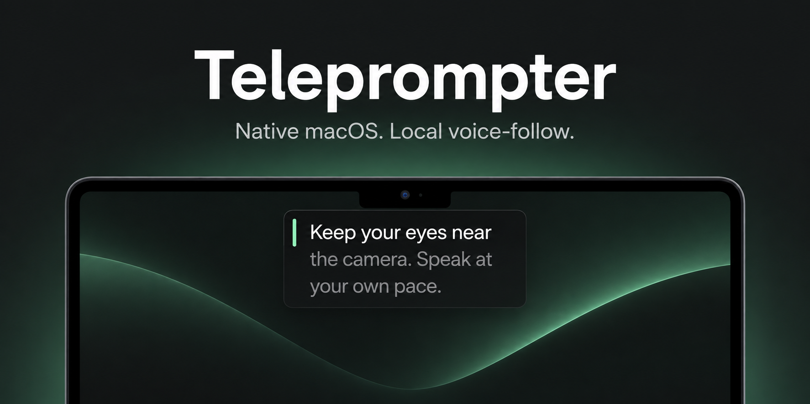

# Teleprompter

Read your script close to the camera while you record. Teleprompter is a native
Mac app built for YouTube videos, with steady auto-scroll and voice-follow that
runs on your Mac. Use Cap, OBS, or your usual recorder for the video.

**Public preview: version 1.2.0 (build 6).** Our first public release was 1.1.2.
Expect updates as people
try it on more Macs. It isn't on the Mac App Store. The banner above is an
illustration of the reading experience.

[Download the public preview](https://github.com/BitL8-ByteShort/Teleprompter/releases/tag/v1.2.0-public-preview.1)
· [Report a bug](https://github.com/BitL8-ByteShort/Teleprompter/issues/new?template=bug_report.yml)

**What's new:** local MCP access for agents and a fix for Cap recording the
prompter when it starts hidden and you reveal it during a take.

## What it does

- **Keeps the words near the camera.** The floating panel sits directly below the
  built-in display's notch, including when an external monitor is your main screen.
- **Scrolls at a steady pace.** Choose 60–240 WPM. The setting is an average across
  the script, so the panel keeps moving at the same speed through short and long lines.
- **Follows your voice.** Apple Speech is the default. Three optional local models
  are available to download and select in the app.
- **Makes retakes easier.** Scroll with a trackpad or mouse wheel, jump between
  paragraphs, restart, or click the line you want to read.
- **Keeps your scripts together.** Save named scripts, search them, and pick up
  each one where you left off. Deleted scripts stay recoverable in Trash.
- **Remembers your setup.** Your model choice, shortcuts, and display settings
  are saved locally.

## Install

Requires **macOS 26 or later**, **Apple Silicon**, and an open built-in MacBook
screen for the reading panel. Xcode is only needed if you're building from source.

1. Download [Teleprompter 1.2.0 for Apple Silicon](https://github.com/BitL8-ByteShort/Teleprompter/releases/download/v1.2.0-public-preview.1/Teleprompter-1.2.0-arm64.dmg) from the [public preview release](https://github.com/BitL8-ByteShort/Teleprompter/releases/tag/v1.2.0-public-preview.1).
2. Open it and drag **Teleprompter.app** into **Applications**.
3. Eject the disk image, then open Teleprompter from Applications.
4. Paste your script and choose **Start reading**.

On first launch, auto-scroll is selected and playback is stopped. Optional speech
models download separately; they aren't bundled into the installer.

See [packaging notes](docs/PACKAGING.md) for signing, notarization, and rebuilding
an installer. The published 1.2.0 app is signed by Salty Panda LLC and notarized by Apple;
see [the release's malware-check evidence](docs/DISTRIBUTION_SECURITY.md).

## Preview status and bug reports

This public preview includes auto-scroll, voice-follow, local model
downloads, saved scripts, and MCP access. It has been tested on the development Mac;
performance while recording on 8 GB and 16 GB Macs still needs testing. Whisper
can take time to prepare on first use. Check a short saved recording to confirm
your recorder excludes the panel before recording a full take.

If something goes wrong, [check existing issues](https://github.com/BitL8-ByteShort/Teleprompter/issues)
and [report a bug](https://github.com/BitL8-ByteShort/Teleprompter/issues/new?template=bug_report.yml).
A GitHub account is needed to submit a report. Include:

- App version and build, available under **Teleprompter → About Teleprompter**.
- Mac model, memory, and macOS version.
- Auto-scroll or voice-follow, and the selected speech engine if relevant.
- Steps to reproduce, what you expected, and what happened.
- A screenshot or short clip if it helps; remove private script text first.

Bug reports don't require the contributor agreement. For questions or feature
ideas, [open an issue](https://github.com/BitL8-ByteShort/Teleprompter/issues/new).

## Set up your first take

The default welcome script is already saved in **My Scripts**. Click **+** or
press **⌘N** to add your own, then paste or type into the editor. Changes save
automatically. **Import** adds a UTF-8 `.txt` file as a new script; **Export**
saves the open script as a text file.

Search by script name or any words in its text. Right-click a script to rename,
duplicate, or move it to Trash. You can also click its title above the editor
to rename it. **Trash → Restore** brings a deleted script back.

Switching scripts saves your edits, pauses playback, and restores that script's
reading position. Editing also pauses playback. Use the sidebar button in the
toolbar to give the editor more room. Word count and estimated reading time
appear above the editor.

The panel starts with 36-point text, a 460-point width, and three visible lines.
Adjust the text size, width, visible lines, background opacity, and left/center/right
alignment from your recording position. The intended distance is about 2–4 feet,
sitting or standing at your desk.

Choose **Auto-scroll** for a steady pace or **Voice-follow** to move with your
speech. **Countdown** offers No countdown, 1 second, 2 seconds, or 3 seconds.
Three seconds is the default, and your choice is saved.

While a take is running, scrolling the panel temporarily takes over. Once your
trackpad or wheel settles, auto-scroll continues from that spot without another
countdown. Voice-follow resumes listening from the new passage. If you paused
manually, scrolling leaves it paused.

Click a line in the panel to start from there. In the editor, place the cursor and
choose **Read from cursor**. These explicit starts use your countdown setting.
Previous/next paragraph and Restart pause at the chosen position.

Hover over the panel to reveal its controls. Hiding the panel or closing the editor
pauses playback. Use the menu-bar icon to reopen the editor. Changing text size or
panel width preserves the current word.

## Voice-follow and local models

Choose your microphone, then start reading. macOS requests microphone access on
first use. If needed, enable it under **System Settings → Privacy & Security →
Microphone**.

| Engine | What it uses |
| --- | --- |
| **Apple Speech** (default) | macOS `SpeechAnalyzer` and `SpeechTranscriber`, English (US) |
| **Moonshine Small** | English Small Streaming, through MoonshineVoice |
| **Parakeet Realtime** | English EOU 120M, 320 ms Core ML variant, through FluidAudio |
| **Whisper Turbo** | Large v3 Turbo, compressed Core ML variant, through WhisperKit |

Open **Transcription models**, just above **Keyboard shortcuts**:

1. Click **Download** beside a model. You can download one, two, or all three.
2. Once it finishes, that button becomes **Use model**.
3. Click **Use model** to select it. The button changes to **Selected**.

Downloading doesn't change the selected engine. Switching engines pauses the take
and keeps your place. Apple Speech uses the system's English assets; macOS installs
them if they're missing.

Only the selected optional model loads. Pause stops microphone capture, while the
model stays ready for another take. Switching engines or returning to auto-scroll
releases it. First-time preparation can take longer, particularly with Whisper.

Voice-follow matches nearby words in your script. It holds during silence,
unrelated ad-libs, or uncertain recognition. For a bigger skip, scroll or select
the intended passage. If recognition or microphone access fails, your position is
preserved and **Use auto-scroll** is available.

Performance varies by Mac. Model downloads and fixture tests work on the development
Mac; recording-load testing on 8 GB and 16 GB machines is still pending.

## Keyboard shortcuts

Change these in **Keyboard shortcuts**. Conflicts are reported in the editor.

| Action | Default |
| --- | --- |
| Play / pause | ⌥⌘P |
| Previous paragraph | ⌥⌘← |
| Next paragraph | ⌥⌘→ |
| Restart | ⌥⌘R |
| Show / hide panel | ⌥⌘H |

## Add scripts from an agent with MCP

An agent can save a named script directly into **My Scripts**. Adding one keeps
your current script and take running. The editor shows which script the agent
added. Opening a script is a separate action and pauses playback.

Install version 1.2.0 or later, then point your MCP client at the app's executable
with `--mcp`. For a standard install in Applications:

```sh
codex mcp add teleprompter -- "/Applications/Teleprompter.app/Contents/MacOS/Teleprompter" --mcp
```

Start a new agent session after adding the connection. Then ask it to save your
script in Teleprompter. You can also ask it to list scripts or open one by ID.
The app opens in the background on the first script request if it isn't running.
If you rename the app or build from source, use that app bundle's full path.
Quit any older app copy before using the new build.

| Tool | What it does |
| --- | --- |
| `add_script` | Saves a new script with `title` and `text`. Returns its saved name and ID. Duplicate names get a numbered suffix. |
| `list_scripts` | Lists IDs, titles, word counts, and dates. Supports search and pagination; excludes Trash and full script text. |
| `open_script` | Opens a saved `script_id`, saves your current edits, pauses playback, and restores the selected script's position. |

The connection runs locally under your Mac user account. It has no network
listener, delete tool, or microphone controls. Your agent client's own privacy
and approval settings still apply to the script you give it.

See [MCP setup and examples](docs/MCP.md) for other clients, limits, and
troubleshooting.

## Recording with Cap or OBS

Get Cap from [cap.so](https://cap.so), or see its source code and setup guide in
the [Cap GitHub repository](https://github.com/CapSoftware/Cap).

Teleprompter doesn't record video. To keep its panel out of a **Cap Desktop 0.6.0**
recording:

1. Open Teleprompter and show the reading panel.
2. In Cap, open **Settings → General → Excluded windows** and add **Teleprompter**.
3. Start a new Cap Studio recording, then start reading in Teleprompter.
4. Check a short saved video for panel exclusion and intact audio before a full take.

**Open Teleprompter before starting Cap's recording.** Cap 0.6.0 resolves the
exclusion from windows present when the take starts. Adding an app to the list
doesn't automatically exclude windows that appear later. If you launch or
restart Teleprompter during a take, stop Cap and start a new recording. Re-adding
the exclusion during that take won't repair it.

In 1.2.0, **Show / Hide Prompter** conceals the text while keeping the same clear
window available to Cap. The hidden panel has no shadow and lets clicks through.
You can start with it hidden using Teleprompter's controls, then reveal it with
Play during the take. This path was verified in a saved Cap Studio recording
on the development Mac. Showing the panel before recording remains the easiest
setup check. The app's bundle identifier is `com.bitl8byteshort.Teleprompter`.

For **OBS**, use a capture source that excludes the panel, such as the specific
app/window you're demonstrating. For **macOS screen recording**, select the
external display or an area below the panel. Test microphone access with your
recorder and Teleprompter running together.

Exclusion depends on the recorder. An actual saved recording is the proof that
it works with your setup; Teleprompter doesn't promise universal invisibility.

## Privacy and local storage

No account is required. Recognition runs on your Mac after setup. Teleprompter
doesn't upload or save microphone audio, and it doesn't request camera access.
Model downloads need an internet connection.

- Scripts, Trash, reading positions, and settings: `~/Library/Application Support/Teleprompter/library.json`
- Previous single draft, kept during upgrades: `~/Library/Application Support/Teleprompter/draft.json`
- Optional models: `~/Library/Application Support/Teleprompter/Models/`

On upgrade, the welcome script becomes the first saved script. Any different
text from your old draft is kept as **Recovered draft**, and the original draft
file stays untouched. Your settings carry over.

If a library can't be read, autosave pauses to protect the original file. You
can still export text from the editor. If a save fails while switching scripts,
the current script stays open so you don't lose your edits.

## Build and test

Open **Teleprompter.xcodeproj**, choose **Teleprompter → My Mac**, and press **⌘R**.
Requires Xcode 26 or later. On another Mac, select your signing team or **Sign to
Run Locally**. Xcode resolves the pinned speech-engine packages.

```sh
./script/build_and_run.sh --verify
swift test
./script/check_library_integration.sh
python3 script/check_mcp.py
```

- [Development guide](docs/DEVELOPMENT.md): source layout, build commands, speech fixtures, and diagnostics.
- [Packaging guide](docs/PACKAGING.md): signed DMG creation and notarization.
- [Validation notes](docs/VALIDATION.md): completed checks and remaining live recording tests.

## Built with

SwiftUI and AppKit, Apple's Speech APIs, [MoonshineVoice](https://github.com/moonshine-ai/moonshine-swift),
[FluidAudio](https://github.com/FluidInference/FluidAudio), and
[WhisperKit](https://github.com/argmaxinc/argmax-oss-swift).

Model sources include [Parakeet Realtime](https://huggingface.co/FluidInference/parakeet-realtime-eou-120m-coreml)
and [Whisper Core ML](https://huggingface.co/argmaxinc/whisperkit-coreml).
See the upstream projects and model cards for their respective licenses.

## License and contributions

Teleprompter is maintained by **Salty Panda LLC** under the
[Teleprompter proprietary license](LICENSE). It permits personal and internal
business use, including creating monetized videos, and reserves the right to
license future releases differently.

Contributions are welcome through the [contribution guide](CONTRIBUTING.md).
Contributors keep ownership of their work and explicitly accept the
[contributor agreement](CLA.md), which permits Salty Panda LLC to use and license
those contributions in future releases, including commercial releases. To
propose a change, fork the public repository and open a pull request.

Public access lets people read and fork the code. Changes to this repository
stay under the owner's control; see [repository access and main branch
rules](docs/REPOSITORY_ACCESS.md). Publishing the repository does not change its
proprietary license.

Third-party code and models retain their own terms. See the
[third-party notices](THIRD_PARTY_NOTICES.md) for the inventory and full license
texts. Those documents ship inside the app and installer; open
**Help → Licenses & Credits** to read them. Model downloads include their own
terms beside the downloaded files.
